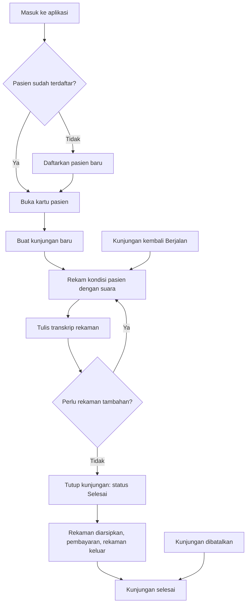
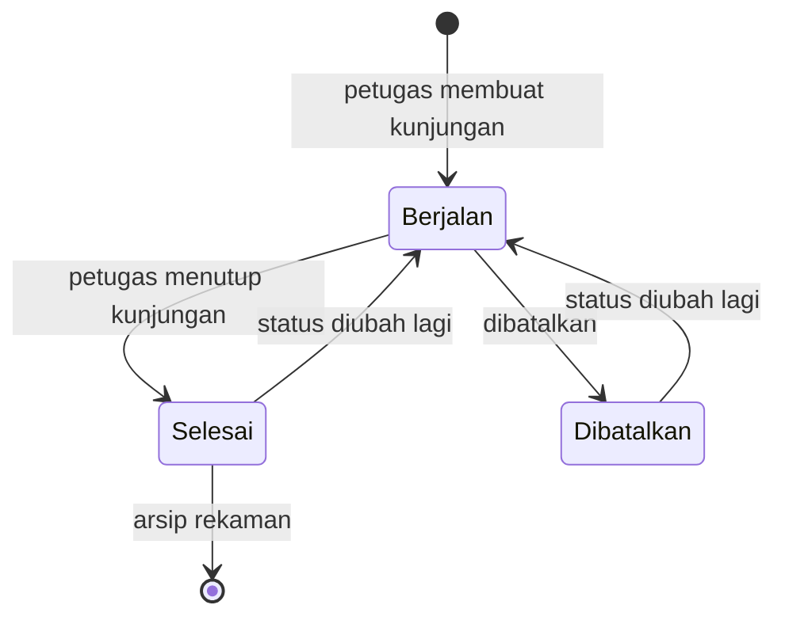

# Alur Kerja FESR-SOAP

Dokumen ini menjelaskan urutan kerja tenaga medis mulai dari masuk ke aplikasi
hingga kunjungan tertutup, serta batas hak akses pada setiap tahap. Berlaku untuk
versi prototipe yang sudah selesai sampai Fase 4 (rekaman audio dan transkrip).

---

## 1. Pelaku dan Hak Akses

| Kemampuan                                        | Administrator | Petugas |
| ------------------------------------------------- | :------------: | :-----: |
| Melihat dan mengelola seluruh data pasien          | ✅             | ✅      |
| Membuat dan menutup kunjungan                      | ✅             | ✅      |
| Merekam, menulis transkrip, mengarsipkan rekaman   | ✅             | ✅ \*  |
| Membuat pengguna baru                              | ✅             | ❌      |
| Mengelola jenis dokumen & template                 | ✅             | ❌      |
| Mendaftarkan perangkat perekam ESP32               | ✅             | ❌      |

\* Petugas hanya boleh pada kunjungan yang ia tangani. Rekaman milik petugas
lain atau kunjungan milik petugas lain akan ditolak dengan pesan 403.

Akun nonaktif tidak dapat masuk sama sekali, walaupun datanya masih ada.

---

## 2. Peta Alur Utama



---

## 3. Tahap 0 — Persiapan (sekali, oleh administrator)

### 0.1 Membuat akun petugas

Administrator membuat akun dari menu **Pengguna**. Tidak ada pendaftaran mandiri.
Setiap akun wajib berstatus aktif agar dapat masuk. Password awal dapat diganti
petugas sendiri lewat menu **Profil**.

### 0.2 Menyiapkan master dokumen

Struktur dokumen disiapkan lebih dulu karena inilah target pemetaan hasil
ekstraksi suara pada fase berikutnya.

1. **Jenis dokumen** — buat katalog, misalnya `soap`.
2. **Template** — buat template, tambahkan bagian (Subjective, Objective,
   Assessment, Plan), lalu isi setiap bagian dengan isian beserta
   **petunjuk pengisian**.

Aturan yang perlu dijaga:

- **Key** isian hanya boleh huruf kecil, angka, dan garis bawah
  (`tekanan_darah`). Judul boleh diubah, key tidak boleh, supaya rekaman lama
  tetap bisa dibaca.
- Isian bertipe **pilihan** wajib disertai daftar pilihannya.
- Jenis dokumen yang masih punya template tidak bisa dihapus, supaya struktur
  yang sudah disiapkan tidak hilang karena salah klik.

Seeder `SoapTemplateSeeder` sudah menyediakan template **SOAP Dewasa** dengan 14
isian, sehingga tahap ini bisa dilewati:

```bash
php artisan db:seed --class=SoapTemplateSeeder
```

### 0.3 Mendaftarkan perangkat perekam ESP32 (opsional)

Menu **Perangkat perekam**. Token hanya ditampilkan satu kali saat issuance —
salin dan simpan, karena yang tersimpan di database hanya hash-nya. Token dapat
diterbitkan ulang kapan saja tanpa menghapus riwayat perangkat.

---

## 4. Tahap 1 — Mencari atau Mendaftarkan Pasien

Menu **Pasien** untuk mencari, **Tambah pasien** untuk mendaftarkan.

| Aturan                    | Keterangan                                                        |
| ------------------------- | ----------------------------------------------------------------- |
| Nomor rekam medis         | Dibuat otomatis `MRN-<tahun>-<nomor urut>`, tidak dapat diubah     |
| NIK                       | Opsional, tetapi unik bila diisi — aman untuk pasien tanpa NIK     |
| Duplikasi data            | Dicegah oleh MRN dan NIK, sehingga tidak ada pasien kembar         |
| Penghapusan               | Mengarsipkan, bukan menghapus. Tab **Arsip** untuk memulihkan      |

Data pasien dikelola seluruh petugas aktif, bukan hanya petugas yang menangani.

---

## 5. Tahap 2 — Membuat Kunjungan

Dari kartu pasien, **Tambah kunjungan**. Isi waktu kunjungan, jenis kunjungan,
keluhan utama, dan pilih petugas yang menangani.

Status awal selalu **Berjalan**. Kunjungan yang berstatus Berjalan adalah satu-
satunya kondisi di mana rekaman baru masih boleh ditambahkan.

---

## 6. Tahap 3 — Dokumentasi Suara

Tombol **Rekaman** pada baris kunjungan. Ada dua jalur dengan hasil yang
identik.

### 6.1 Perekaman di peramban

| Tombol           | Fungsi                                                             |
| ---------------- | ------------------------------------------------------------------ |
| **Mulai rekam**  | Meminta izin mikrofon, mulai menghitung waktu, level suara bergerak |
| **Jeda / Lanjut** | Menahan perekaman tanpa membuang bagian yang sudah terekam          |
| **Selesai**      | Menghentikan, memutar pratinjau, menyimpan berkas di peramban        |
| **Buang**        | Membatalkan rekaman yang belum disimpan                              |
| **Rekam ulang**   | Mengulang rekaman yang gagal                                         |
| **Simpan rekaman**| Mengunggah berkas ke server dengan progres                          |

Berkas otomatis terhenti pada menit ke-10. Ukuran maksimal 50 MB.

### 6.2 Unggahan dari perangkat ESP32

Perangkat memakai endpoint yang sama, tetapi autentikasinya lewat header
`X-Device-Token` sehingga tidak perlu peramban.

```bash
# Cek token dikenal
curl -H "X-Device-Token: TOKEN" http://127.0.0.1:8000/api/device

# Kirim rekaman ke kunjungan yang sedang berjalan
curl -X POST http://127.0.0.1:8000/api/encounters/1/recordings \
  -H "X-Device-Token: TOKEN" \
  -F "audio=@suara.wav" -F "duration_seconds=95"
```

Endpoint mengembalikan 201 beserta id rekaman yang tersimpan.

### 6.3 Aturan rekaman

- Hanya pada kunjungan **Berjalan**
- Hanya petugas yang menangani kunjungan, atau administrator
- Berkas disimpan pada disk privat tanpa URL publik, sehingga tidak dapat
  diunduh tanpa melewati pemeriksaan hak akses
- Audio disimpan apa adanya sesuai format pengirim, tanpa konversi di server
- Rekaman permanen tidak dapat dihapus, hanya diarsipkan

---

## 7. Tahap 4 — Transkrip

Setiap rekaman memiliki kolom transkrip yang diisi manual pada fase ini.
Rekaman dapat didengarkan langsung dari halaman rekaman, lalu transkripnya
diisi, lalu disimpan. Transkrip tidak hilang saat rekaman diarsipkan.

Pengenalan suara otomatis (Whisper) akan mengisi kolom ini secara otomatis pada
Fase 5. Struktur isian template sudah disiapkan untuk itu, sehingga yang
diperlukan tinggal mengisi kolom yang ada, bukan mengubah alur.

---

## 8. Tahap 5 — Menutup Kunjungan

Ubah status kunjungan menjadi **Selesai** dari tombol ubah. Setelah itu:

- Rekaman baru tidak dapat ditambah
- Tombol **Arsipkan** pada rekaman menjadi aktif
- Kunjungan menjadi read-only (lihat catatan di bagian 10)

---

## 9. Arsip dan Pemulihan

Penghapusan berarti pengarsipan, berlaku untuk pasien, kunjungan, maupun
rekaman. Tidak ada data yang hilang permanen.

| Objek         | recovery                                                            |
| ------------- | ------------------------------------------------------------------- |
| Pasien        | Tab **Arsip** pada halaman Pasien                                     |
| Rekaman       | Tombol **Pertahankan** pada daftar rekaman                           |
| Kunjungan     | Status diubah kembali menjadi **Berjalan**, lalu rekaman dipulihkan   |

Syarat: rekaman hanya dapat diarsipkan bila kunjungan **tidak lagi** berstatus
Berjalan. Pemulihan mengembalikan rekaman ke daftar aktif.

---

## 10. Status Kunjungan



| Status         | Rekaman baru | Arsip rekaman | Keterangan                        |
| -------------- | :----------: | :-----------: | --------------------------------- |
| **Berjalan**   | ✅           | ❌            | Kunjungan masih boleh diisi            |
| **Selesai**    | ❌           | ✅            | Kunjungan ditutup                 |
| **Dibatalkan** | ❌           | ✅            | Kunjungan tidak jadi dilaksanakan |

> **Catatan.** Saat ini perubahan status ke `Berjalan` dari `Selesai` maupun
> `Dibatalkan` masih diperbolehkan tanpa batasan, dan kolom isian
> tetap dapat disunting ulang. Pernyataan "read-only" pada komentar enum
> `EncounterStatus` belum ditegakkan di lapisan HTTP. Bila read-only
> diperlukan, aturan itu perlu ditambahkan di `SaveEncounterRequest` dan
> `EncounterRecordingController`.

---

## 11. Ceklis Sebelum Menutup Kunjungan

- [ ] Semua rekaman sudah listens dan transkripnya sudah diisi
- [ ] Keluhan utama dan jenis kunjungan sudah sesuai
- [ ] Petugas penanganan sudah benar
- [ ] Tidak ada rekaman yang perlu diarsipkan setelah ditutup

---

## 12. Peta Rute

| Rute                                        | Halaman                        |
| ------------------------------------------- | ------------------------------ |
| `/dashboard`                                | Ringkasan pasien dan kunjungan |
| `/patients`                                 | Daftar & arsip pasien          |
| `/patients/{pasien}/encounters/create`      | Tambah kunjungan               |
| `/patients/{pasien}/encounters/{kunjungan}/recordings` | Rekaman kunjungan      |
| `/admin/users`                              | Manajemen pengguna             |
| `/admin/document-types`                     | Katalog jenis dokumen          |
| `/admin/document-types/{jenis}/templates`   | Template dokumen               |
| `/admin/devices`                            | Perangkat perekam ESP32        |

---

## 13. Yang Belum Tersedia

Bagian ini sengaja dicantumkan agar alur tidak disalahpahami sebagai sudah
lengkap.

| Kemampuan                     | Status                    |
| ----------------------------- | ------------------------- |
| Perekaman peramban            | ✅ Selesai                |
| Unggahan ESP32 dari sisi server| ✅ Selesai                |
| Firmware ESP32                | ❌ Belum ditulis          |
| Transkrip manual              | ✅ Selesai                |
| Pengenalan suara otomatis    | ❌ Fase 5                 |
| Ekstraksi entitas klinis     | ❌ Fase 6                 |
| Draf SOAP & tinjau            | ❌ Fase 7                 |

Perangkat ESP32 belum dapat diuji tanpa alat fisik. Sisi server sudah siap
menerima unggahan, dan jalur protokolnya sudah terotorisasi dengan pengujian
otomatis, sehingga yang tersisa hanya firmware dan kalibrasi mikrofon.
